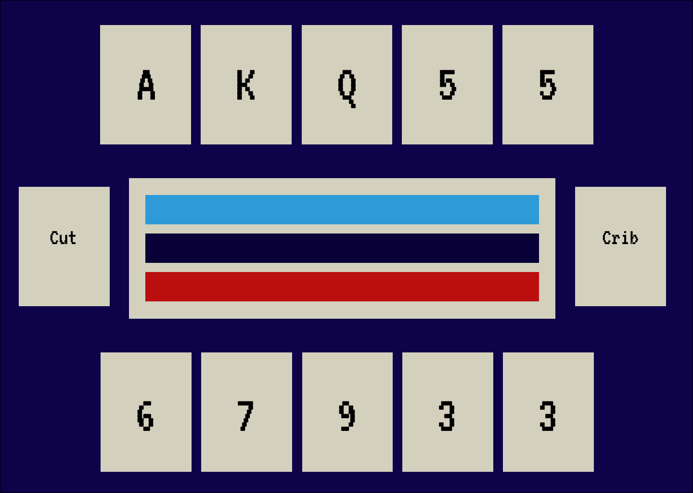

# Alivia Kleinfeldt Individual Project

This repository contains Alivia's Individual Project files for Enterprise Java.

### Problem Statement

Few free-to-play cribbage apps exist. The ones out now require an account creation or app download before being able to 
even view the game let alone play, are cluttered with pop-up ads, and all have a similar, outdated interface; a board 
with impossibly small pegs, and a red deck of cards on a wooden or fuzzy green table. 

Login walls have been advised against by the Nielsen Norman Group since 1999, as they stop many users in their tracks. 
The wood and red-green visuals are stale, predictable, and potentially problematic color combos for users with 
colorblindness. No apps are on the market that are geared towards providing the ultimate visual experience for all, from 
those who seek color or visual customization options to those who want a fresh and unique online cribbage interface out
of the box that all can use with ease.

This project is to deliver a transparent, customizable online cribbage app with a modern interface. Users may see the
game board and use the app without creating an account, but by creating an account can keep track of game dates and 
records. An interface with a preset design/color scheme will be available, but customization options for the deck and 
background will be available as well.
### Project Technologies/Techniques

* Database
    * MySQL 8.0.22
* Dependency Management
    * Maven
* CSS
    * Bootstrap or Materialize (tbd)
* Logging
    * Log4J2
* Project Lombok
* Unit Testing
    * JUnit tests 
* IDE: IntelliJ IDEA

### Design

* [User Stories](UserStories.md)
* [Tasks]
* [Application Flow]
* [Database Design]

### [Project Plan](ProjectPlan.md)

#### [Weekly Reflection](WeeklyReflection.md)
#### [TimeLog](TimeLog.md)
